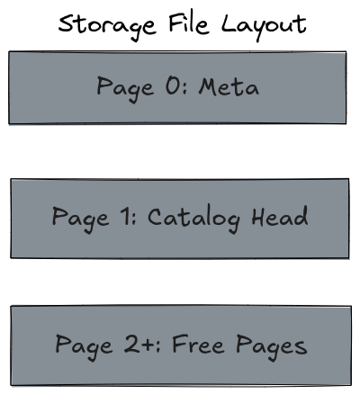
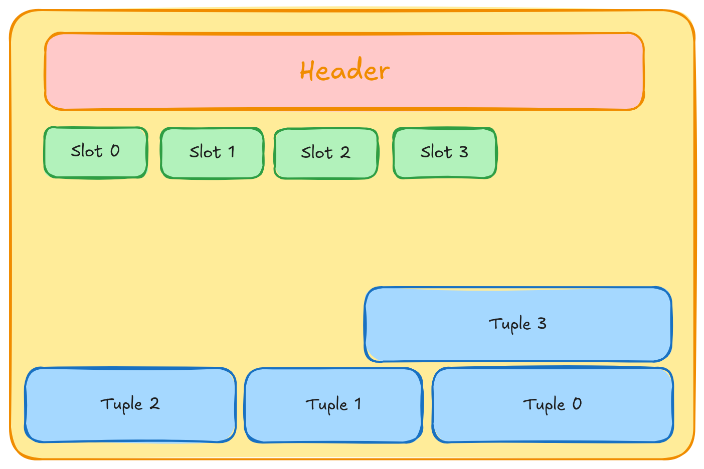

# Storage File Layout

**Status:** Accepted
**Component:** `src/storage` (`DiskManager`)

## Context

KernSQL stores an entire database in a single file, addressed as a sequence of fixed-size
4 KB pages (`PAGE_SIZE`, `page_id_t`). `DiskManager` owns raw page I/O (`ReadPage`/`WritePage`)
and page allocation (`AllocatePage`/`DeallocatePage`), but has no opinion about what a page
*means* — that's left to the layers above (catalog, heap, index).

This doc fixes:
- how free pages are tracked and reused,
- what, if anything, is reserved at fixed positions in the file,
- the header every page carries, and why each field is there.

## File layout

| Page(s) | Owner | Contents |
|---|---|---|
| Page 0 | `DiskManager` | Meta page. Only field actually persisted today is `freelist_head`, stored in the page header's `next_page_id`; `page_size` and `page_count` are fixed/recomputed rather than stored (`page_count` = file size / `PAGE_SIZE` on every `Open()`). No magic number or format version is written yet — see Open Questions. |
| Page 1 | Catalog (layer above storage) | Reserved root page. `DiskManager` guarantees it exists after `Open()`/init and never hands it out via `AllocatePage`; its contents are opaque to storage. |
| Page 2+ | Freelist-managed | Handed out by `AllocatePage`, returned by `DeallocatePage`. Contents fully opaque to `DiskManager` — heap pages, index pages, or free pages depending on current owner. |

`DiskManager` is deliberately unaware of "catalog," "table," or "index" as concepts. It
only guarantees page 1 exists and is never reused for anything else; what page 1 *means*
is entirely the catalog layer's decision.

### Freelist

Free pages are threaded into a singly-linked list using the page header's `next_page_id`
field (see below) — no separate free-page format or dedicated free-space map is needed.
`page 0` persists only the list head, `freelist_head`.

- `AllocatePage`: pop `freelist_head` (follow its `next_page_id` to the new head); if the
  freelist is empty, grow the file by one page instead.
- `DeallocatePage`: push the page onto the freelist — set its `next_page_id` to the current
  `freelist_head`, then set `freelist_head` to it.

This makes allocation and deallocation O(1) with no extra on-disk structure beyond the one
head pointer in the meta page.

### Multi-page objects (catalog, heap tables, indexes)

Nothing above `DiskManager` is guaranteed to fit in one page. Any object that outgrows a
single page (the catalog first, but every heap table and index eventually) grows by
`AllocatePage`-ing a new page anywhere in the file and linking it via `next_page_id` on the
current last page. Page 1 is only the catalog's *first* page, not its full extent — scanning
the catalog means following `next_page_id` from page 1 until `INVALID_PAGE`.

> **A page is in at most one chain at a time, and `page_type` decides which chain that is.**
> `FREE` → the next free page in the freelist. `HEAP` or `CATALOG` → the next page of that
> object. `INDEX_LEAF` → the right sibling. There is no page state in which two of those
> readings are simultaneously valid, which is what makes one field safe to share across all of
> them: a page leaves its old chain in the same operation that changes its `page_type`.
> `DeallocatePage` is the concrete case — it stamps `FREE` and threads the page onto the
> freelist together, so the heap link it used to hold is gone by the time anyone can read the
> field as a freelist link.

Index root pages are the one exception to "storage doesn't know about layout": since a
B+tree's root page can change across root splits, it cannot be a fixed well-known page like
page 1. Each index's current root page id is stored as mutable data in the catalog, not in
`DiskManager`.

## Page header

Every page — meta, catalog, heap, index, free — carries the same fixed-size header at
offset 0, so the format is uniform regardless of what currently owns the page.

| Field | Type | Size | Purpose |
|---|---|---|---|
| `page_type` | `uint8_t` (enum) | 1 | Distinguishes meta / heap / index-internal / index-leaf / free. Lets any page be sanity-checked against how it's being interpreted. |
| `flags` | `uint8_t` | 1 | Reserved; always zero. |
| `format_version` | `uint16_t` | 2 | `PAGE_FORMAT_VERSION`. Stamped on every header written; nothing reads it back yet, which is the point — a future format change has a discriminator to branch on. |
| `page_id` | `page_id_t` (int32) | 4 | The page's own id, redundant with the offset it was read from and redundant on purpose: derive identity from the offset alone and a disagreement is undetectable by construction. Catches misdirected writes, off-by-one page arithmetic, torn extends. InnoDB's `FIL_PAGE_OFFSET`. |
| `next_page_id` | `page_id_t` (int32) | 4 | Forward chain link. Which chain is decided by `page_type` — see the invariant above. |
| `prev_page_id` | `page_id_t` (int32) | 4 | Reserved for future backward traversal. Unused today. |
| `page_lsn` | `lsn_t` (uint64) | 8 | LSN of the last WAL record applied to this page. Enables idempotent redo during recovery (skip reapplying a log record if `page_lsn >= record_lsn`) and is the field the buffer pool's write-ahead rule will check before flushing a dirty page. Reserved even though no WAL is planned, to avoid a page-format break. |
| `checksum` | `uint32_t` | 4 | Reserved. See Non-goals. |
| `reserved` | `uint32_t` | 4 | Padding, explicit rather than implicit so `ReadFrom`/`WriteTo` move a fully-defined 32 bytes. |

Total: exactly **32 bytes** (`PAGE_HEADER_SIZE`), asserted in `page_header.hpp`. Field order is
chosen so every member lands on its natural alignment with no implicit padding. That leaves
**4064 bytes** (`PAGE_BODY_SIZE`) for page-type-specific content — and 4064, not 4096, is what a
page guard hands out, so no caller above the buffer pool can name the header bytes as raw memory.

For heap pages specifically, that remaining space is a slotted page: a slot directory grows
forward from right after the header, tuple data grows backward from the end of the page, and
a `RID{page_id, slot}` addresses a tuple indirectly through its slot — so compaction can move
tuple bytes and update a slot's offset without invalidating any RID that points at it.

`INVALID_PAGE` (`-1`, already defined in `common/types.hpp`) is the sentinel for both
`next_page_id` and `prev_page_id` — end of chain, no sibling, or field unused.

## Non-goals

- **Checksums** (page-level or WAL-record-level) are explicitly out of scope. They exist to
  detect torn writes and bit rot, both of which are power-loss / disk-level failure modes.
  KernSQL's stated crash-safety guarantee is surviving `kill -9`, not power loss — a
  `SIGKILL` cannot tear an in-flight `pwrite`, so there is nothing for a checksum to catch
  under this threat model. If the durability guarantee is ever extended to power loss, this
  decision needs revisiting alongside full-page-writes (checksums alone only detect
  corruption, they don't repair it).
- **Power-loss / disk-level torn-write safety** is out of scope for v1, for the same reason.
- **Free-space map / bitmap allocator** was considered and rejected in favor of the
  linked-list freelist: no contiguous-allocation requirement exists for heap/index pages, so
  the simpler O(1) scheme is sufficient.

## Open questions

- Whether page 0 should gain a magic number and format version. Today `Open()`'s
  corruption check is only "page 0's `page_type` is `META`, page 1's is `CATALOG`" —
  it can't distinguish a kernSQL file from some other page-aligned file that happens
  to land on those two byte values, and can't detect a format version mismatch.
- Whether index-node key storage is fixed-size (leveraging `VARCHAR(n)`'s declared bound) or
  uses a slotted variable-length format like heap pages — left to the B+tree design doc.
- Whether internal (non-leaf) index nodes also carry a right-sibling `next_page_id` for
  B-link–style crabbing, or only leaves — left to the B+tree design doc.
